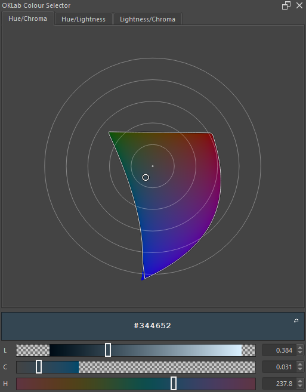
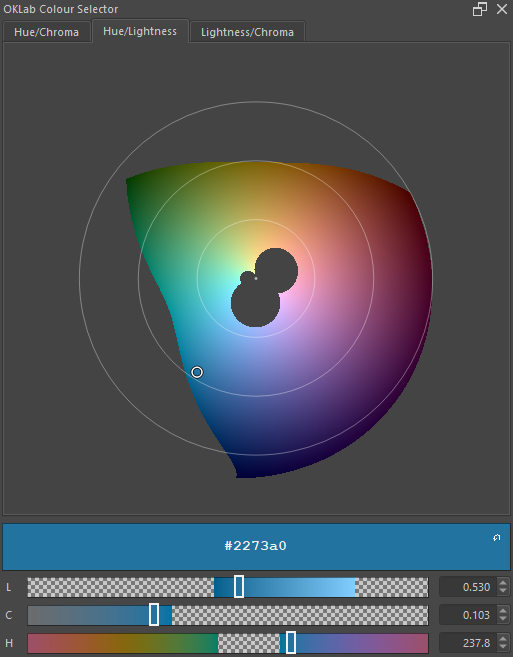
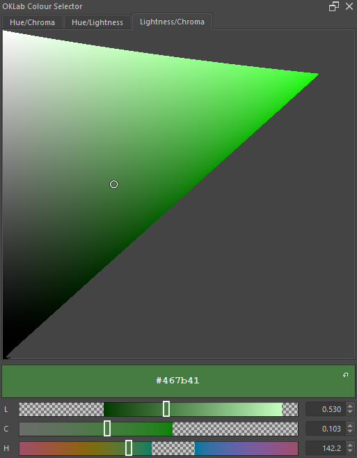

# OKLab Colour Picker for Krita

  
  
  
  

A perceptual colour picker for Krita, built on OKLab / OKLCh.
Pick with lightness, chroma and hue sliders and get perceptually uniform results.

## Why

HSV and HSL are fundamentally flawed descriptions of sRGB not related to perception of color &mdash; the same slider distance can feel like a nudge in one place and a jump in another, and lightness drifts when you only meant to change hue.

OKLab was designed around perception of colour. So in an OKLCH color picker equal steps look equal, hue changes keep their lightness, and lightness changes don't shift hue.
As a result - less time spent fighting with the picker.

OKLab was introduced by [Björn Ottosson](https://bottosson.github.io/posts/oklab/) in 2020.

## Highlights

- Three 2D selector tabs: **Hue / Chroma**, **Hue / Lightness**, **Lightness / Chroma**.
- Gradient sliders and number boxes for direct L, C, H control.
- Live preview while you drag; commits to Krita's foreground colour on release.
- Swatch with hex entry and a one-click revert to the previous colour.
- Out-of-gamut indicator so you always know when sRGB can't reach your pick.

<table>
    <tr>
        <td width="33%" valign="top"><b>Hue/Chroma tab</b></td>
        <td width="33%" valign="top"><b>Hue / Lightness tab</b></td>
        <td width="33%" valign="top"><b>Lightness / Chroma tab</b></td>
    </tr>
    <tr>
        <td></td>
        <td></td>
        <td></td>
    </tr>
</table>

A video explaining the plugin:

## Install

Needs Krita 5.2+ and NumPy in Krita's Python.

1. [Download latest release](https://github.com/gibapiu/oklab_colour_picker_krita/releases/latest) as ZIP.
2. In Krita select **Tools &rarr; Scripts &rarr; Import Python Plugin From File**.
3. Restart Krita.
4. Open **Settings &rarr; Dockers &rarr; OKLab Colour Selector**.
5. Proceed with the dependencies installation.
6. Restart Krita again.

Platform-specific commands and NumPy setup: [docs/install.md](docs/install.md).

## Use

Pick a tab, drag inside the selector, fine-tune with the L / C / H controls, or type a hex value directly into the swatch. The selector previews live and commits on release.

Short walkthrough: [docs/usage.md](docs/usage.md).

## Trouble?

Most issues are missing NumPy or a `.desktop` file in the wrong folder. See [docs/troubleshooting.md](docs/troubleshooting.md) for more details to to fix it.

Spot a bug or have a suggestion? Open [an Issue](https://github.com/gibapiu/oklab_colour_picker_krita/issues) and stay tuned!
