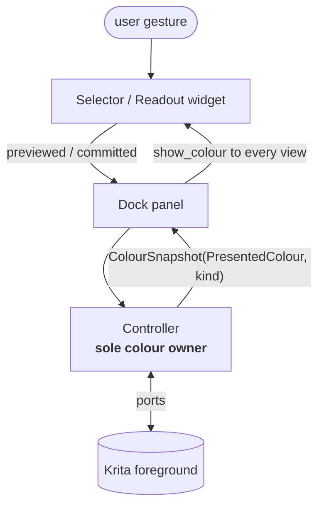
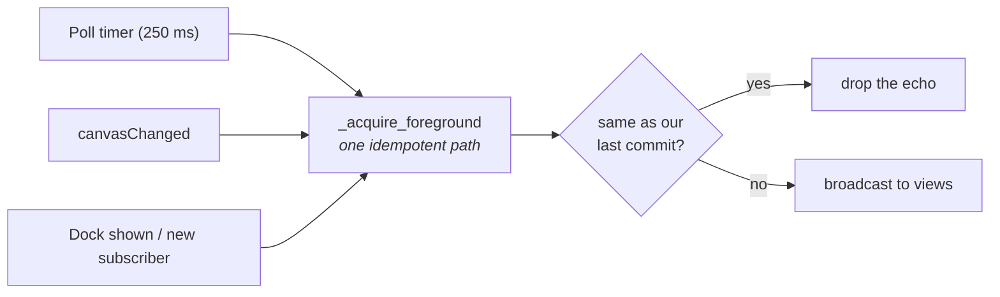
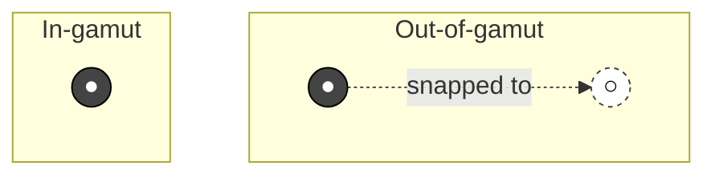

# OKLab Colour Picker - Architecture

## 1. What this is

A Krita docker for picking colours in **OKLab / OKLCh** - a colour space where equal number steps look like equal visual steps. Lightness ramps stay straight, hue sweeps keep their brightness, and chroma changes don't drift in hue.

For artists, this means a picker that *feels* right. Three slice views - a hue/chroma disk, a hue/lightness disk, and a lightness/chroma rectangle - sit next to an L/C/H panel with sliders, a hex box, and a swatch. Every move goes straight to Krita's foreground colour.

Two things to care about above all:

- **Great feel for artists.** No lag while dragging. No surprise hue jump when chroma drops to zero. No flicker when switching views.
- **Fast by design.** Heavy maths runs on NumPy. The picker caches what it can and never redraws a slice that hasn't changed.

**What this is *not*.** Not a palette manager, not a colour-management tool, not a replacement for Krita's Advanced Colour Selector. It is one focused docker that picks a single foreground colour in a perceptually uniform space.

---

## 2. Core architecture

### 2.1 Layers

The code is split into five layers, stacked bottom to top. Lower layers don't know about higher ones. Only the pure layers (blue) hold colour maths. The controller (yellow) is the single owner of the current colour. Only the top layer touches Krita. Dedicated tests (`tests/test_import_discipline.py`) enforce this.

### 2.2 One colour, one owner, one direction

<table>
<tr>
<td width="55%" valign="top">

The controller holds the colour. Views send the user's intent upward.
The controller derives the presented read model once and broadcasts that
snapshot back down. Nothing else writes colour or resolves presentation anywhere.

Three rules make this work:

- **Every view gets every broadcast.** No "skip the view that started it". Each view decides locally whether to draw the new colour or ignore it.
- **The colour carries two things.** OKLab paint (what Krita writes) and OKLCh coordinates (what the UI was driving with). The controller keeps the coordinates intact through Krita's round-trip - that's how a hue survives `chroma=0`.
- **Presentation has one owner.** `ColourIntent` is controller state. `PresentedColour` is a derived read model. The controller publishes both as a `ColourSnapshot`; the dock only fans that snapshot out to views.
- **`kind` is a hint, not an order.** `PREVIEW`, `COMMIT`, `ROLLBACK`, `EXTERNAL`, `INITIAL` - these tell a view *why* the colour arrived. They never decide whether a view should draw.

</td>
<td width="45%" valign="top">

</td>
</tr>
</table>

### 2.3 Picking up colour changes from Krita

Krita has no "foreground changed" signal, so the controller polls. All routes lead to one idempotent function inside the controller. A short grace window suppresses polling syncs while the user is mid-gesture, so the picker never fights the hand that's painting. The exception is `canvasChanged` - a document switch is real news and always wins.

### 2.4 Selector state machine

Each selector view is a small state machine. It is pure Python - no Qt - and the widget is just a thin shell around it.

| State | When | Indicator |
|-------|------|-----------|
| `IDLE` | Showing a colour pushed from outside | From the model - solid ring, plus a dashed ring if the colour falls outside this slice |
| `DRAGGING` | Mouse held down | At the cursor (snapped if out of gamut) |
| `KEYBOARD` | Arrow / page-key nav | At the target pixel |
| `PINNED` | After commit; holds the click spot until something external changes the colour | At the committed pixel |

`IDLE` quietly redraws on every broadcast, and `PINNED` quietly swallows echoes of its own colour - both are no-op self-transitions, kept out of the diagram to keep it readable. The rules below spell them out.

```mermaid
flowchart LR
    S(( )) --> IDLE([IDLE])
    IDLE -- "press / key" --> FLIGHT(["DRAGGING / KEYBOARD<br/><i>in flight</i>"])
    FLIGHT -- "commit" --> PINNED([PINNED])
    FLIGHT -- "cancel" --> IDLE
    PINNED -- "press / key" --> FLIGHT
    PINNED == "external colour change" ==> IDLE
    style S fill:#000,stroke:#000
```

A few rules the rest of the code leans on:

- The anchor (the pixel the indicator sticks to) exists only inside an interaction state. `IDLE` has no memory of where you last clicked.
- The indicator is a pure function of state. No `if`-ladders in the widget.
- `PINNED` only swallows echoes of *its own* colour. Any other broadcast drops it back to `IDLE`.
- Only the controller writes colour. Views never read each other.

The readout panel runs the same idea with two states: `IDLE` and `EDITING`. While editing, any colour pushed from elsewhere is held aside (not applied). If you commit, your edit wins. If you cancel, the held colour comes back.

---

## 3. UX decisions

Choices made so the picker *feels* right under an artist's hand:

- **Hold the hue at `chroma=0`.** Hue is undefined at zero chroma in maths, but artists expect "raise chroma and get my hue back". The intent object carries the hue even when the paint is neutral grey.
- **Out-of-gamut still drags smoothly.** When the cursor leaves the in-gamut area, the model snaps to the nearest valid point. A dual-ring indicator (solid where you wanted, dashed where it landed) shows what happened - the gesture never breaks.
- **Selected-colour fallback matches Krita.** Once a colour is selected, fallback display is resolved by `gamut_fallback` through clipped 8-bit sRGB - the same colour the swatch shows and Krita writes. Selector drag snapping is only for gesture continuity; it is not reused as the selected-colour fallback.

- **No flicker between views.** Self-feedback checks, `PINNED` echo checks, and adapter writes all compare colours in 8-bit sRGB - Krita's own precision, never raw float `==`. This kills a whole class of flicker bugs.
- **Indicator doesn't drift after commit.** The model is queried in OKLCh, not OKLab. Recovering OKLCh from 8-bit paint drifts by ~0.001 - enough to lose the indicator after every commit. Asking in coordinates makes the answer exact.

---

## 4. Performance decisions

Choices made to keep the picker fast under continuous drag:

- **Cache the slice model.** The Qt-free `SelectorModelCache` rebuilds a slice only when its fixed coordinate changes - not on every preview tick. Views that are mid-gesture are skipped entirely.
- **NumPy on the hot path.** Pixel maths, gamut masks, and snap searches are vectorised. Slice and slider images are RGBA buffers Qt can blit directly.
- **Debounce commits.** Quick drags coalesce into one adapter write on the next event-loop turn - hundreds of mouse-move events become one Krita write.

---

## 5. Ground rules

- **Write self-documenting code.** Let names do the talking. Add a comment only when the *why* isn't obvious from reading.
- **Test first, test deep.** Cover every layer directly. Run the state machine against a fake context - no Qt. Run widget and dock tests offscreen with fake clocks and timers - no `sleep`, no flake. Use property tests (`hypothesis`, fixed seed) for round-trips, echo idempotence, indicator purity, and anchor lifetimes across random gestures.
- **Keep contracts clean between layers.** Make the selector model a full abstract base class - no duck typing. Reach Krita through three named ports: `ForegroundAdapter`, `CommitScheduler`, `ForegroundTimer`. Check import rules with a test, not with trust.
- **Prefer simple over clever.** One controller. One source of truth. One state machine per view family. No source tags. No skip-originator logic.
- **Use what the platform gives.** Reach for Krita's `ManagedColor` for profile conversion, NumPy for pixel maths, and Qt's `QImage`, `QTimer`, and signals for the UI. Don't rewrite what already works.
